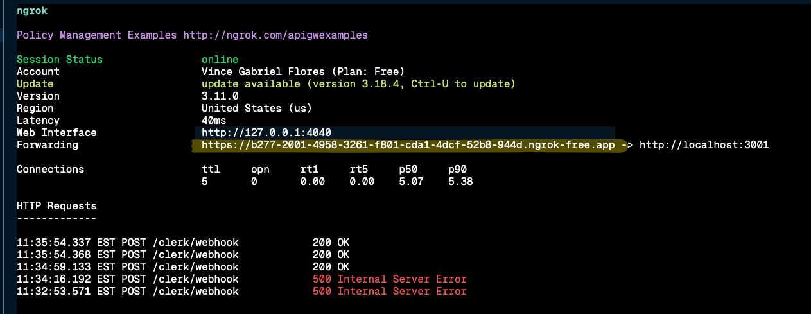
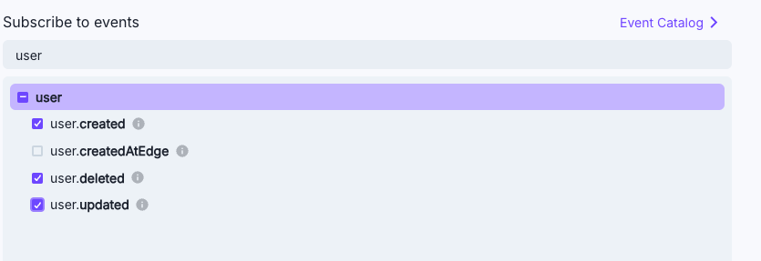

> # Latte's Fitness App

Although many fitness apps are available, we, along with many others, feel that none truly cater to our unique health goals in a personalized and effective way. That's why we decided to create an app that acts like a personal fitness trainer, designed to tailor a program specifically for each user.

Our app not only creates personalized workout plans based on the user's goals but also adapts and evolves with the user’s progress. By leveraging AI-driven recommendations and advanced progress tracking, we ensure that each program is as dynamic and flexible as a real trainer would be. Additionally, our app fosters a sense of community, offering support and motivation through shared goals and challenges.

With this, we aim to help users reach their desired physical goal while providing a personalized, ever-evolving experience that supports them throughout their fitness journey.

# Installation:

1. Make sure node.js is installed or up-to-date https://nodejs.org/en
2. Open your preferred ide
3. Clone the GitHub repo (run the command below in the terminal)

```
git clone https://github.com/EECS3311F24/project-latte.git
```

3. Install any dependencies that pop up (y)

```
cd  frontend
npm install
```

```
cd backend
npm install
```

#Set up Dependencies

For the set up and running the project please have at least 3 terminals running. 
1. one for frontend
2. one for backend
3. one for ngrok

### Make `.env` file

```
# /frontend
cp env-example .env
```

```
# /backend
cp env.example .env
```

### API Ninja

Head to [Api Ninja](https://api-ninjas.com/) and get a free api token and add to your `.env` file.

```
#/frontend/.env
#API NINJA
EXPO_PUBLIC_API_ROUTE_ORIGIN=...
```

### Database: Set up a Postgres database([ Neondb ](https://neon.tech/home) is nice), and add the connection string to

```
# /backend/.env
DATABASE_URL=...
```

If using[ Neondb ](https://neon.tech/home) make sure to use the url


### Set up Clerk

1. Create a new Clerk app [here](https://clerk.com/)
2. From the clerk quickstart select Expo and copy the public_publishable_key
3. In your `.env` file add the api keys from the dashboard. e.g

```
# /frontend/.env
  EXPO_PUBLIC_CLERK_PUBLISHABLE_KEY=...
```

#### Clerk Webhhok

For the clerk webhhok to work set up an ngrok url. NOTE: Make sure you have ngrok installed([here](https://download.ngrok.com/mac-os) or [docs with windows](https://ngrok.com/docs/guides/device-gateway/windows/)) and have the backend running on a port different to the port for the frontend.

Make sure that backend is running on a separate terminal

```
#/backend
npm run start:dev
```
then on another terminal run

```
ngrok  http 3001
```

Then add the url like the one below as a webhook endpoint in the clerk dashboard with a prefix `/clerk/webhook`.




Under **"Subscribe to events"**, select the following events



Then add the webhook secret to you `.env` file

```
#/backend/.env
WEBHOOK_SECRET=
```

Then restart the backend server

```
#/backend
npm run start:dev
```

# Usage

Run the project

```
#/frontned
npm start
```

Open the project on your browser by pressing w in the terminal

```
#/backend
npm run start:dev
```

### API docs

To see the swagger docs, open `http://localhost:3001/api`. NOTE: you `port=3001` can be different.


## Contribution:

We do not use git flow. However, new features are branched and named according to the feature. Any bugs will be brought up with GitHub issues. Before merging with the main branch, a pull request is made and reviewed by one or more team members.

## Sample Demo of the Project

A demonstration of our app's current implementation is shown in this [video link]([https://drive.google.com/file/d/14MwtScbs8dhyQpm-SW7bxG0saV1TD8VQ/view](https://drive.google.com/file/d/1kBpB9okgABVoCC0CJaDd88qlTYrVZhDq/view?usp=sharing)).
